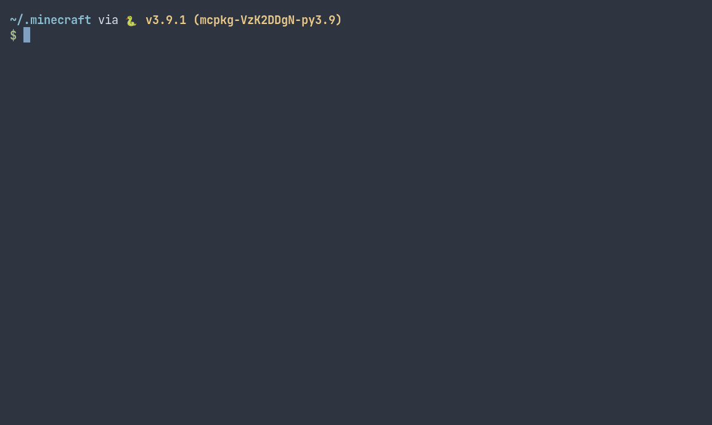

# mcpkg

Package manager for Minecraft datapacks and resourcepacks



## Installation

### Dependencies

- **Python 3.9:** If you're on linux or macOS, you should install from your package manager. If you're on Windows, you can install python from [their site](https://www.python.org/)
- **Python pip:** Installation instructions can be found [here](https://pip.pypa.io/en/stable/installing/)

### Installing the cross-platform way

The easiset and most recommended way to install mcpkg is with `pip`

```sh
pip install mcpkg
```

## Developing on VSCode

mcpkg uses poetry; a Python virtual environment. To make sure you're running in the virtual environment, run:

```sh
poetry env info -p
```

to get the virtual environment path. Then edit `.vscode/settings.json`:

```json
"python.pythonPath": "<output of poetry env info -p>/bin/python3",
"python.analysis.stubPath": "<output of poetry env info -p>/lib/python3.9/site-packages",
```
